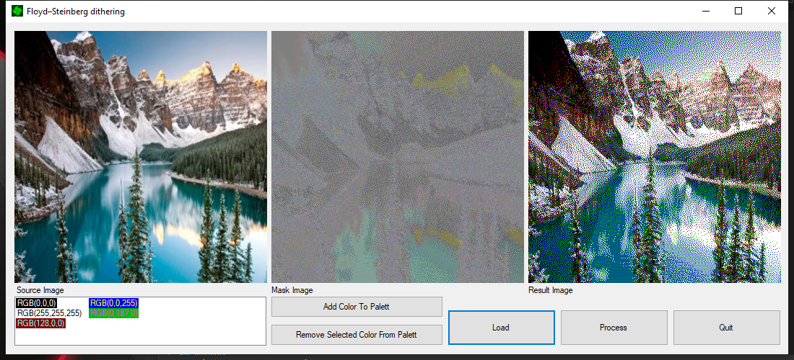

# Floyd_Steinberrg-Dithering
A program that helps you verify the minimum set of colors in the pallet to recreate the picture.

## Run Sample
The picture on the left is re-created using 5 colors only to form the image on the right.

This means that on a resource-limited platform (FPGA, for example), you can use a pallet of 5 colors to create the image that looks as if it had a normal colorspace.

